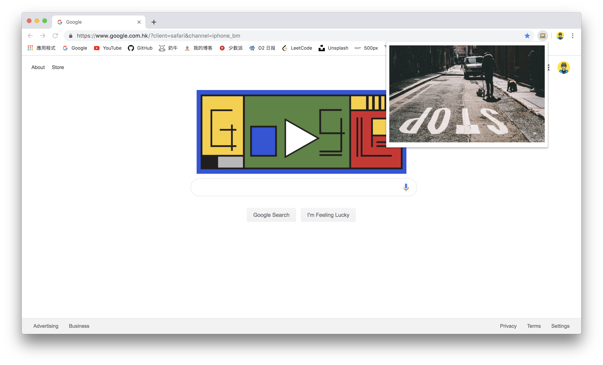

# Unsplash 非官方图片获取插件
  

  
截止至今日 2019 年 4 月 13 日，项目仍在保持更新中，持续为用户带来更多的功能和更好的体验。

## 安装
1. Clone 至本地
2. 打开 Chrome 开发者模式 （浏览器地址栏输入 chrome://extensions/）
3. 载入插件选择本项目文件夹
4. 载入后开启右下角滑块开关
  
## 功能
随机获取一张 2560*1600 的图片

## TO-DO
* 用户登录
* 关键词搜索图片
* 选择图片大小

## License
[MIT](https://github.com/yiukuenchu/desktoplash/blob/master/LICENSE)

